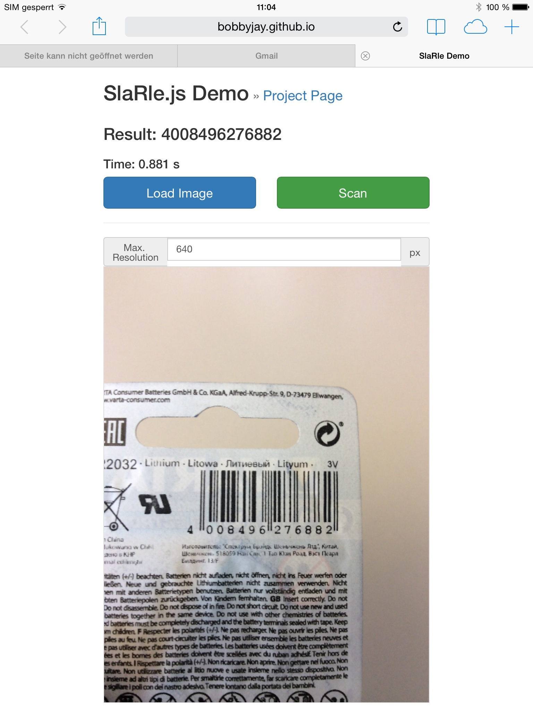

# SlaRle.js
### A JavaScript-based localization and decoding library for EAN-13 barcodes in HTML5

SlaRle (SLA - Scanline-Algorithm, RLE - Run-Length-Encoding) is a pure JavaScript implementation for locating barcode regions in images and decoding EAN-13 barcodes.

This algorithm was implemented during the work for my master's thesis.
The aim was to create an app using HTML5 with client-side barcode recognition functionality.
As mentioned above, SlaRle consists of two parts: localization and decoding.
Localization is based on an algorithm from Stern [1] with enhanced parameterization.
Decoding follows the description from O'Sullivan et al. [2] with the additional feature of scanline movement if a scan wasn't successful.

SlaRle is far from perfect, but tries to find a compromise between performance and accuracy in scanning EAN-13 barcodes.
Therefore, only horizontal barcodes will be detected due to the scanline algorithm that starts from the top and ends at the bottom.
During the implementation, the algorithm was tested against the 1055 images from Muenster BarcodeDB [3].
Due to the horizontal barcode limitation, some images needed to be rotated from [3]: 167 images by 90° and 32 by 180°.
After this modification, SlaRle reached the following results:

- 70,9 % accuracy at 480px maximum image size
- 81,3 % accuracy at 640px max
- 84,4 % accuracy at 800px max

### Demo

Please check out the demo at: http://bobbyjay.github.io/SlaRle.js/
For taking a photo or selecting an existing photo (depends on the mobile browser) click "Load Image". This will load your image into the canvas at the bottom scaled with the maximum resolution set in the input field above. After the image is loaded the "Scan" button will trigger SlaRle.

### Limitations of SlaRle

- **huge barcode size**: If the barcode is too large, the barcode region will be broken up and can't be detected properly. This is caused by a parameter that defines the maximum allowed distance between two barcode lines or gradients within the image. Currently set to 1.7% of the images width (horizontal barcodes).
- **barcode rotation**: SlaRle parses the input image for horizontal Scanlines from top to bottom. Therefore, the barcodes need to be aligned properly to be detected by SlaRle. It strongly depends on the height and distance between lines of the barcode for successful localization.

### License

MIT License

### Future work

- **performance tweaks**: Currently, due to research purposes and better debugging, SlaRle uses a conversion of the image data to an array. In the future, it should also work directly on canvas' Uint8ClampedArray so the conversion can be thrown away. Additionally, there are some ideas of improving the localization algorithm at some points.
- **clean-up**: As mentioned above the code is a bit messy and not documented well. This will be changed in a future version. The objects sent to and received from SlaRle need to be declared properly.

### Other JS barcode reader

Here is a list of other interesting barcode reading algorithms implemented in JavaScript:

- **quaggaJS** https://github.com/serratus/quaggaJS
- **JOB** https://github.com/EddieLa/JOB
- **barcode.js** https://github.com/liip/barcode.js
- **Balkenkode** https://bitbucket.org/jrosskopf/balkenkode
- **get_barcode_from_image.js** https://gist.github.com/tobytailor/421369

### References

- [1] Stern: "Mobile Produkterkennung für ein Behinderten-Assistenzsystem: Automatische Lokalisierung und Dekodierung von 1-D Barcodes", 2011
- [2] O'Sullivan, Stewart, Goerzen: "Real World Haskell", 2008
- [3] Wachenfeld, Terlunen, Jiang: "Robust Recognition of 1-D Barcodes Using Camera Phones", 2008